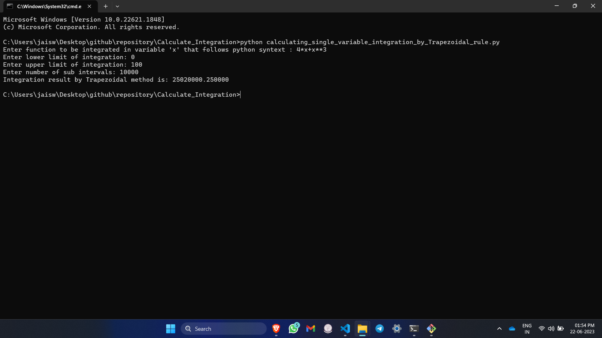

# Calculate-Integration

<<<<<<< HEAD
=======
 **Should have python install**

**Steps to Use**
1. open terminal/shell where you place this folder.
2. ```
   python calculating_single_variable_integration_by_Trapezoidal_rule.py
   ```
   type/copy-past this in terminal hit enter.
3. 
   enter the function in python supported  syntex.
   enter lower limit
   enter upper limit
   enter how many fragment you want to divide it (example 100000)


>>>>>>> d3389dea3b76b013cf60e10b79d0910949d460dd
